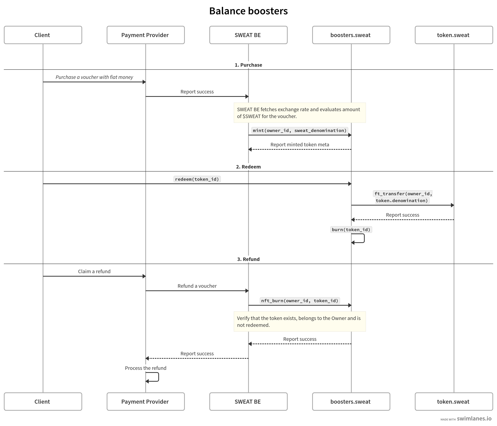

# sweat-booster

NFT vouchers for $SWEAT.

## Quickstart

1. Make sure you have installed [rust](https://rust.org/).
2. Install the [`NEAR CLI RS`](https://github.com/near/near-cli-rs)

If you already have `rustup` installed, you can ensure that the correct version of the compiler and the NEAR CLI is
installed as well:

```shell
make install
```

### General information

To learn how to build the project, deploy it, and run tests run the following command:

```shell
make help
```

### Build and Deploy the Contract

First build the contract using provided `make` command:

```bash
make build
```

Then deploy and initialize it. The following command will launch a wizard to deploy the account to any network.

```bash
make deploy
```

# Use case

Balance boosters are NFT Vouchers for \$SWEAT. They are lazy minted and contain the denomination in \$SWEAT.
As a User, I can purchase a Balance Booster for 10 \$USD, for example. With an exchange rate of 1 \$USD = N \$SWEAT,
I'll have a Balance Booster with denomination of 10*N \$SWEAT. Once a User redeems the Balance Booster,
they receive corresponding amount of \$SWEAT to their account. In case of successful transfer the NFT burns.
If the User refunds the Balance Booster, it must be burnt as well.

## User stories

1. As a Server, I want to mint a Balance Booster NFT of certain denomination for particular User.
2. As a Server, I want to burn a Balance Booster NFT in case when the User refunds it in 3rd party service.
3. As a User, I want to redeem a Balance Booster NFT and get \$SWEAT on my account.

# Implementation

## Interaction within the system



